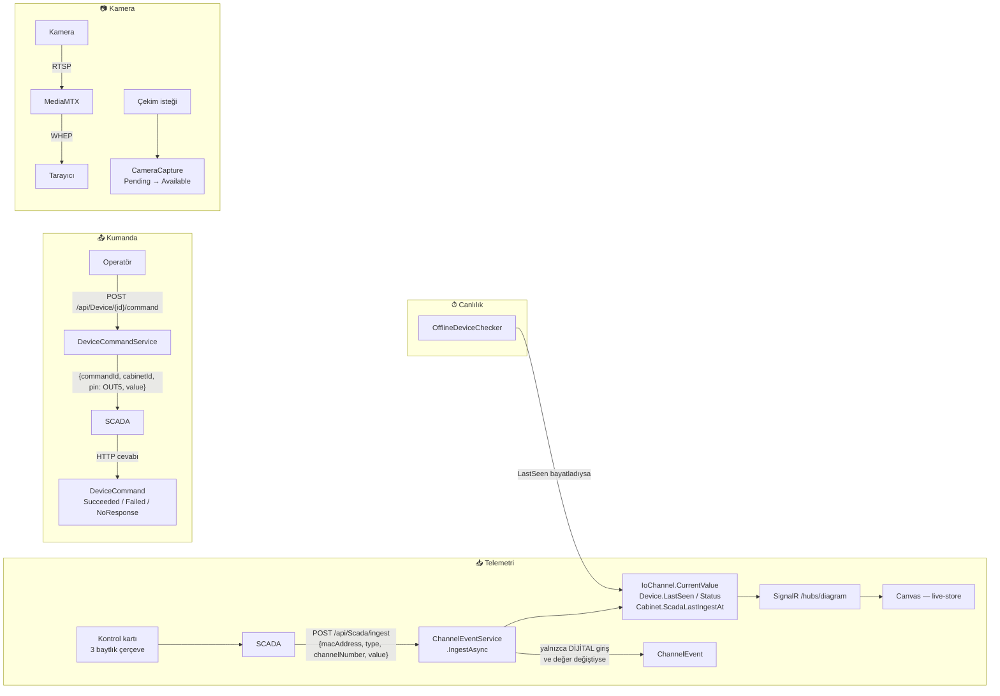

# CabinetOS Veri Modeli — Uygulanan Şema ve Gelecek Modüller

Bu doküman iki iş yapar:

1. **Bugün kodda ve veritabanında ne varsa onu tam olarak tarif eder** (§ 2). Alan listeleri buraya *yazılmıştır* — okumak için `Backend/`'i açmanız gerekmez.
2. **Tasarlanmış ama kodlanmamış modülleri** model + entegrasyon reçetesiyle tarif eder (§ 4). O bölümdeki hiçbir tablo veritabanında **yoktur**.

> **Kendi kendine yeter.** Önceki sürüm, derlenmeyen bir referans model klasörüne (`Entities/`, `Enums/`, `namespace Hibrit`) atıfta bulunuyordu. O klasör bu dosyayla birlikte dağıtılmayabilir; bu yüzden ihtiyaç duyulan bütün alan listeleri artık buranın içindedir. Referans klasör hâlâ repoda duruyorsa tarihsel kayıt olarak okunabilir — **normatif olan bu dosyadır.**

İlgili dokümanlar: `PROJECT_VISION.md` (neden), `PROJECT_OVERVIEW.md` (mimari kararlar), `ROADMAP.md` (ne zaman, niçin), `docs/api-contract/` (API gövdeleri), `scada_communication_guide.md` (kartın bayt protokolü), `CLAUDE.md` (çalışma kuralları).

---

## 1. Genel bakış

CabinetOS, mevcut bir SCADA'nın **üzerinde** duran sektör bağımsız bir gözetim platformudur. Sahayla Modbus/RS485 konuşmaz; SCADA ile HTTP üzerinden `{tip, kanal, değer}` üçlüsü alışverişi yapar. **Kabin şeması sinyalin anlamının kaynağıdır**: operatör hangi pinin hangi sensöre gittiğini çizdiği için, "kanal 7 → 1" ham verisi "dış kapı hareket algılandı" diye gösterilebilir.

### Modül durumu

| Modül | Durum | Tablolar |
|---|---|---|
| **Core** | ✅ Uygulandı | `Company`, `Cabinet`, `DeviceStatus`, `DeviceType`, `Log`, `Archive` |
| **Auth** | 🟡 Uygulandı — yetki **zorlanmıyor** | `User`, `Role`, `Permission`, `RolePermission`, `RefreshToken` |
| **Diagram** | ✅ Uygulandı | `ComponentTemplate`, `ComponentTemplatePin`, `Device`, `Pin`, `Connection`, `DiagramAnnotation`, `CanvasSettings` |
| **Connectivity** | ✅ Uygulandı | `IoChannel` |
| **Commands** | ✅ Uygulandı | `DeviceCommand` |
| **Monitoring** | 🟡 Kısmen — kamera + kanal olayları | `Camera`, `CameraCapture`, `ChannelEvent` |
| **Automation / Workflow** | ❌ Yok — § 4.1 | — |
| **Alarm / Notification** | ❌ Yok — § 4.2 | — |
| **Access Control** | ❌ Yok — § 4.3 | — |
| **SNMP izleme** | ❌ Kapsam dışı — § 4.4 | — |
| **Telemetri geçmişi** | ❌ Yok — § 4.5 | — |
| **Sensör / metrik katmanı** | ❌ Yok — § 4.6 | — |
| **AuditLog** | 🟡 Teknik iz var, anlamsal iz yok — § 4.7 | (`Log`, `Archive`) |
| **Çoklu kiracı izolasyonu** | ❌ Yok — § 4.8 | — |

**Toplam 23 `DbSet`:** 21 domain entity + `Log` + `Archive`.

---

## 2. Uygulanan şema

### 2.1 UML — bugün var olan model

```mermaid
classDiagram
    direction LR

    class Company {
        +Guid Id
        +string Name
        +string? Description
        +bool IsActive
    }

    class Cabinet {
        +Guid Id
        +string Name
        +Guid CompanyId
        +double? Latitude
        +double? Longitude
        +string? LocationDescription
        +string? GsmIp
        +string? NetworkIp
        +int? DeviceStatusId
        +DateTime? LastSeen
        +string? ScadaBaseUrl
        +bool ScadaIsEnabled
        +int ScadaCommandTimeoutMs
        +DateTime? ScadaLastIngestAt
        +bool IsActive
    }

    class DeviceStatus {
        +int Id
        +string Name
        +string Color
        +string Icon
        +string? Description
    }

    class DeviceType {
        +int Id
        +string Name
        +string Category
    }

    class ComponentTemplate {
        +Guid Id
        +string Name
        +int DeviceTypeId
        +bool IsSystemTemplate
        +double Width
        +double Height
        +string BackgroundColor
        +string? BackgroundImageUrl
        +bool IsActive
    }

    class ComponentTemplatePin {
        +Guid Id
        +Guid ComponentTemplateId
        +string Name
        +double RelativeX
        +double RelativeY
        +HandleSide Side
        +int? ChannelNumber
        +PinFunction Function
        +PinDirection Direction
        +VoltageLevel? VoltageLevel
    }

    class Device {
        +Guid Id
        +string Name
        +double CoordinateX
        +double CoordinateY
        +double Rotation
        +int ZIndex
        +bool IsLocked
        +bool IsVisible
        +Guid CabinetId
        +Guid ComponentTemplateId
        +int? DeviceStatusId
        +string? IpAddress
        +string? MacAddress
        +string? ExternalCode
        +DateTime? LastSeen
        +bool IsActive
    }

    class Pin {
        +Guid Id
        +string Name
        +double RelativeX
        +double RelativeY
        +HandleSide Side
        +Guid? IoChannelId
        +PinFunction Function
        +PinDirection Direction
        +VoltageLevel? VoltageLevel
        +int? ChannelNumber
        +Guid DeviceId
        +Guid? ComponentTemplatePinId
        +bool IsDeleted
    }

    class IoChannel {
        +Guid Id
        +Guid DeviceId
        +Guid CabinetId
        +int ChannelNumber
        +PinDirection Direction
        +bool IsEnabled
        +string? CurrentValue
        +string Name
        +DateTime? ValueUpdatedAt
        +bool IsDeleted
    }

    class Connection {
        +Guid Id
        +Guid CabinetId
        +Guid SourcePinId
        +Guid TargetPinId
        +string? Label
        +WireType WireType
        +string Color
        +LineStyle LineStyle
        +double StrokeWidth
        +EdgeRouting Routing
        +string? WaypointsJson
        +int ZIndex
        +bool IsDeleted
    }

    class DiagramAnnotation {
        +Guid Id
        +Guid CabinetId
        +string Name
        +string Text
        +AnnotationShape Shape
        +double CoordinateX
        +double CoordinateY
        +double Width
        +double Height
        +double Rotation
        +int ZIndex
        +bool IsLocked
        +bool IsVisible
        +string BackgroundColor
        +string FontColor
        +double FontSize
        +bool IsBold
        +string BorderColor
    }

    class CanvasSettings {
        +Guid Id
        +Guid CabinetId
        +int GridSize
        +bool SnapToGrid
        +BackgroundVariant BackgroundVariant
        +string GridColor
        +string BackgroundColor
        +double MinZoom
        +double MaxZoom
    }

    class DeviceCommand {
        +Guid Id
        +Guid DeviceId
        +Guid? IoChannelId
        +DeviceCommandType CommandType
        +string? PayloadJson
        +CommandStatus Status
        +Guid? RequestedByUserId
        +DateTime? SentAt
        +DateTime? RespondedAt
        +string? ResultMessage
        +bool IsDeleted
    }

    class ChannelEvent {
        +long Id
        +Guid IoChannelId
        +Guid CabinetId
        +string Value
        +string? PreviousValue
        +DateTime OccurredAtUtc
        +DateTime ReceivedAtUtc
    }

    class Camera {
        +Guid Id
        +Guid CabinetId
        +string Name
        +string? Manufacturer
        +string? Model
        +string IpAddress
        +int RtspPort
        +int HttpPort
        +int? HttpsPort
        +string? Username
        +string? Password
        +int MainStreamChannel
        +int SubStreamChannel
        +bool MainStreamEnabled
        +bool SubStreamEnabled
        +int SnapshotChannel
        +int? MonitoringPort
        +int? DeviceStatusId
        +DateTime? LastSeen
        +int PingIntervalSec
        +bool IsMonitoringEnabled
        +string? LastConnectionError
        +bool IsActive
    }

    class CameraCapture {
        +long Id
        +Guid CameraId
        +CaptureType Type
        +CaptureStatus Status
        +DateTime CapturedAtUtc
        +int? DurationSec
        +string? RelativePath
        +long? SizeBytes
        +string? FailureReason
        +DateTime? ExpiresAt
        +Guid? RequestedByUserId
    }

    class User {
        +Guid Id
        +Guid CompanyId
        +string FullName
        +bool IsActive
    }

    class Role {
        +Guid Id
        +bool IsImmutable
        +bool IsActive
    }

    class Permission {
        +int Id
        +string Code
        +string DisplayName
        +string Category
    }

    class RolePermission {
        +Guid RoleId
        +int PermissionId
    }

    class RefreshToken {
        +Guid Id
        +Guid UserId
        +Guid DeviceId
        +string Token
        +DateTime ExpirationUtc
        +int TTL
        +bool IsRevoked
    }

    Company "1" *-- "*" Cabinet
    Company "1" *-- "*" User
    Cabinet "1" *-- "*" Device
    Cabinet "1" *-- "*" Connection
    Cabinet "1" *-- "*" DiagramAnnotation
    Cabinet "1" *-- "0..1" CanvasSettings
    Cabinet "1" *-- "*" Camera
    Cabinet "1" *-- "*" ChannelEvent
    Cabinet "1" o-- "*" IoChannel : denormalize
    DeviceType "1" o-- "*" ComponentTemplate
    ComponentTemplate "1" *-- "*" ComponentTemplatePin
    ComponentTemplate "1" o-- "*" Device
    Device "1" *-- "*" Pin
    Device "1" *-- "*" IoChannel
    Device "1" *-- "*" DeviceCommand
    IoChannel "0..1" o-- "*" Pin : terminals
    IoChannel "1" *-- "*" ChannelEvent
    ComponentTemplatePin "1" o-- "*" Pin
    Pin "1" o-- "*" Connection : source
    Pin "1" o-- "*" Connection : target
    Camera "1" *-- "*" CameraCapture
    DeviceStatus "1" o-- "*" Device
    DeviceStatus "1" o-- "*" Cabinet
    DeviceStatus "1" o-- "*" Camera
    Role "1" *-- "*" RolePermission
    Permission "1" o-- "*" RolePermission
    User "1" *-- "*" RefreshToken
    User "1" o-- "*" DeviceCommand
```



### 2.2 Veri akışı — bugün çalışan yollar



> **Kuyruk yoktur.** `DeviceCommand` bir bekleme kuyruğu değil, gönderilmiş isteğin kaydıdır. SCADA'ya ulaşılamıyorsa komut bekletilmez — `NoResponse` ile başarısız olur ve operatör hatayı anında görür. Kazanç: geç uygulanan kumanda riski tasarımdan çıkar. Bedel: "bağlantı gelince kendiliğinden gönder" yoktur.
>
> **Tek istisna `CameraCapture`'dır** (`Pending → Available/Failed`): kumanda milisaniyelerde cevaplanır, çekim dakikalar sürebilir.

---

### 2.3 Entity referansı

Hepsi `Backend/CabinetOs.Model/Entities/` altındadır. Audit alanları (`CreatedBy`, `UpdatedBy`, `CreateDateUtc`, `UpdateDateUtc`) `IAuditableEntity`'den, soft-delete alanları (`DeletedBy`, `IsDeleted`, `DeletedDateUtc`) `ISoftDeletableEntity`'den gelir ve her tabloda tekrar yazılmamıştır.

#### Core

**`Company`** — `IEntity, IAuditableEntity, IActivatableEntity`
`Id` (Guid, PK) · `Name` · `Description?` · `IsActive`

**`Cabinet`** — `IEntity, IAuditableEntity, IActivatableEntity`

| Alan | Tip | Not |
|---|---|---|
| `Id` | `Guid` | PK |
| `Name` | `string` | zorunlu |
| `CompanyId` | `Guid` | FK |
| `Latitude` / `Longitude` | `double?` | harita |
| `LocationDescription` | `string?` | |
| `GsmIp` / `NetworkIp` | `string?` | iki ayrı erişim yolu |
| `DeviceStatusId` | `int?` | cihazlarının **en kötüsü**; `null` = hiç telemetri yok |
| `LastSeen` | `DateTime?` | |
| `ScadaBaseUrl` | `string?` | kumandanın gideceği adres |
| `ScadaIsEnabled` | `bool` | kapalıysa ingest 400 döner |
| `ScadaCommandTimeoutMs` | `int` | kabin başına; `NoResponse`'u `Failed`'dan ayıran şey |
| `ScadaLastIngestAt` | `DateTime?` | arayüzdeki "son veri" tazeliği |
| `IsActive` | `bool` | |

> **Kabin = bir kontrol kartı.** Kartın adres uzayı düzdür; kanal benzersizliği bu yüzden cihazda değil kabinde kurulur (§ 2.6).
>
> SCADA ayarları ayrı tabloya çıkarılmadı: ilişki 1:1 ve dört kolon için JOIN anlamsız. **Kimlik doğrulama alanı (`IngestKey`) eklendiğinde bu karar yeniden değerlendirilmelidir** — o noktada gizli değerlerin `db.Cabinets.ToListAsync()` ile belleğe çekilmemesi gerekir.

**`DeviceStatus`** — lookup. `Id` (int) · `Name` · `Color` · `Icon` · `Description?`
**`DeviceType`** — lookup. `Id` (int) · `Name` · `Category`

> Bu ikisi enum **değil tablo**dur, çünkü kullanıcıya görünen ad/renk/ikon/kategori taşırlar. Değerleri `EntityEnums`'daki karşılıklarıyla birebir sabitlenmiştir. `Device` üzerinde tip kolonu **yoktur** — tip `ComponentTemplate.DeviceTypeId`'den okunur.

**`Log`** / **`Archive`** — `IProjectEntity` (yaşam döngüsü kurallarının dışında), `Model/ProjectEntities/`. `SaveChanges` interceptor'ları yazar:
`Id` (int) · `EntityId?` · `TableName?` · `RequesterId?` · `Action` (`CrudType`) · `Data?` · `ClientIp?` · `UserAgent?` · `DateUtc`
`Archive` ayrıca `OldData?` / `NewData?` taşır.

#### Auth

**`User`** — `IdentityUser<Guid>` türevi + `CompanyId`, `FullName`, `IsActive` + audit.
**`Role`** — `IdentityRole<Guid>` türevi + `IsImmutable`, `IsActive` + audit.
**`Permission`** — `IImmutableEntity`. `Id` (int) · `Code` · `DisplayName` · `Category`.
**`RolePermission`** — bileşik PK `(RoleId, PermissionId)`. Surrogate `Id` **yok** — aynı iznin bir role iki kez atanmasını engelleyen şey bu bileşik anahtardır.
**`RefreshToken`** — `Id` · `UserId` · `DeviceId` · `IpAddress?` · `ClientType?` · `Token` · `ExpirationUtc` · `CreateDateUtc` · `TTL` · `IsRevoked`.

> ⚠ **Yetki zorlanmıyor.** `permission` claim'i JWT'ye yazılır ama **hiçbir yerde okunmaz**. Kumanda butonları yalnızca arayüzde gizlenir ve öyle etiketlenir. Token yenileme akışı da yoktur (401 → `clearSession()`; access token 24 saat).

#### Diagram

**`ComponentTemplate`** — `IEntity, IAuditableEntity, IActivatableEntity`

| Alan | Tip | Not |
|---|---|---|
| `Id` | `Guid` | |
| `Name` | `string` | |
| `DeviceTypeId` | `int` | FK → `DeviceType` lookup |
| `IsSystemTemplate` | `bool` | seed şablonları |
| `Width` / `Height` | `double` | canvas piksel |
| `BackgroundColor` | `string` | `#RRGGBB` |
| `BackgroundImageUrl` | `string?` | `wwwroot/uploads/templates` |
| `IsActive` | `bool` | **kullanımdaki şablon silinemez** (`Device → ComponentTemplate` Restrict); emeklilik `IsActive = false` |

**`ComponentTemplatePin`** — şablonun pin şeması.

| Alan | Tip | Not |
|---|---|---|
| `Id`, `ComponentTemplateId` | `Guid` | cascade delete |
| `Name` | `string` | `"IN1"`, `"COM"` |
| `RelativeX` / `RelativeY` | `double` | **0..1 kesir**, DB `CHECK` |
| `Side` | `HandleSide` | |
| `ChannelNumber` | `int?` | **null = telemetri kanalı yok** (GND, PE…) |
| `Function` | `PinFunction` | NO/NC kutbunun kaynağı |
| `Direction` | `PinDirection` | |
| `VoltageLevel` | `VoltageLevel?` | |

**`Device`** — çizime bırakılmış cihaz örneği.

| Alan | Tip | Not |
|---|---|---|
| `Id` | `Guid` | **istemci üretir**, zaman sıralı (`lib/sequential-id.ts`) |
| `Name` | `string` | |
| `CoordinateX` / `CoordinateY` | `double` | canvas piksel |
| `Rotation` / `ZIndex` / `IsLocked` / `IsVisible` | | çizim durumu |
| `CabinetId` / `ComponentTemplateId` | `Guid` | ikisi de **insert-only** — farklı değer göndermek 400 |
| `DeviceStatusId` | `int?` | telemetriyle yazılır |
| `IpAddress` | `string?` | `MacAddress` ile birlikte diyagram deltasından yazılır; benzersizlik kısıtı yok |
| `MacAddress` | `string?` | `DeviceType.ControlModule` cihazlarda **ingest'in kabin çözümlemesidir** — SCADA bu adresi gönderir, sunucu birebir string eşleşmesiyle kabini bulur. **Sistem genelinde benzersiz** (`IX_Device_MacAddress`, `WHERE MacAddress IS NOT NULL AND IsActive = 1`) — kabin bazlı değil |
| `ExternalCode` | `string?` | **çözümlemede kullanılmıyor** — yalnız gösterim |
| `LastSeen` | `DateTime?` | bayat süpürücüsünün baktığı alan |
| `IsActive` | `bool` | |

**`Pin`** — cihazın klemensi. İçeriğini **sunucu** şablondan kopyalar; **Id'sini istemci üretir**.

| Alan | Tip | Not |
|---|---|---|
| `Id` | `Guid` | istemci üretir |
| `Name` / `RelativeX` / `RelativeY` / `Side` | | şablondan kopya |
| `IoChannelId` | `Guid?` | **null olabilir** — her pinin kanalı yoktur |
| `Function` / `Direction` / `VoltageLevel` / `ChannelNumber` | | şablondan kopya |
| `DeviceId` | `Guid` | |
| `ComponentTemplatePinId` | `Guid?` | şema doğrulamasının anahtarı |
| `IsDeleted` | `bool` | |

> `Pin` **değer taşımaz.** Anlık değer kanalın özelliğidir: bir rölede NC/COM/NO üç klemens **tek** kanaldır ve değer üçünde birden duramaz.

**`IoChannel`** — telemetri/kumanda noktası.

| Alan | Tip | Not |
|---|---|---|
| `Id` | `Guid` | istemci üretir |
| `DeviceId` | `Guid` | |
| `CabinetId` | `Guid` | **denormalize** — `Device.CabinetId` kopyası, § 2.7 |
| `ChannelNumber` | `int` | kartın nokta numarası |
| `Direction` | `PinDirection` | `Input` \| `Output` \| `Bidirectional` \| `AnalogInput` |
| `IsEnabled` | `bool` | kapalıysa ingest atlar |
| `CurrentValue` | `string?` | **tipsiz**; `null` = "kanal var, okunamadı" — `"0"` ile aynı değil |
| `Name` | `string` | anlamın taşıyıcısı |
| `ValueUpdatedAt` | `DateTime?` | |
| `IsDeleted` | `bool` | |

**`Connection`** — iki pin arası kablo.
`Id` · `CabinetId` · `SourcePinId` · `TargetPinId` · `Label?` · `WireType` · `Color` · `LineStyle` · `StrokeWidth` · `Routing` · `WaypointsJson?` · `ZIndex` · soft-delete.

**`DiagramAnnotation`** — not / kutu / ok.
`Id` · `CabinetId` · `Name` · `Text` · `Shape` · `CoordinateX/Y` · `Width` · `Height` · `Rotation` · `ZIndex` · `IsLocked` · `IsVisible` · `BackgroundColor` · `FontColor` · `FontSize` · `IsBold` · `BorderColor`.

> **Hiçbir yaşam döngüsü arayüzü uygulamaz** — `Remove()` gerçekten siler.
> **Canvas elemanlarında kalıtım yoktur:** `Device` ve `DiagramAnnotation` iki bağımsız tablodur, ortak canvas alanları bilinçle tekrarlanır. Soyut bir taban sınıf `Ignore<T>()` satırına bağımlılık yaratırdı ve o satır unutulduğunda EF sessizce TPH kurardı. Tekrarın kazancı: her sınıf yalnızca ihtiyacı olan alanı taşır (`DiagramAnnotation`'da `BackgroundImageUrl` yoktur).

**`CanvasSettings`** — kabin başına tek satır.
`Id` · `CabinetId` (**unique**) · `GridSize` · `SnapToGrid` · `BackgroundVariant` · `GridColor` · `BackgroundColor` · `MinZoom` · `MaxZoom`.

> Satır yoksa okuma **varsayılan döner, kayıt oluşturmaz**; yazma ayrı uçtan upsert eder (`PUT /api/CanvasSettings/cabinet/{id}`).

#### Commands

**`DeviceCommand`**
`Id` (Guid) · `DeviceId` · `IoChannelId?` · `CommandType` · `PayloadJson?` · `Status` · `RequestedByUserId?` · `SentAt?` · `RespondedAt?` · `ResultMessage?` · soft-delete.

> `PayloadJson` **niyeti ve teldeki değeri birlikte** saklar (`{ turnOn, value, polarity }`). Yalnızca değer saklansaydı, NC kablolu bir rölenin geçmişinde `"0"` gören biri bunun "kapat" mı "aç" mı olduğunu bir daha çıkaramazdı.
> `Status` üzerinde kuyruk indeksi **gerekmez** — kuyruk yok; `(DeviceId, SentAt)` geçmiş indeksi yeterlidir.

#### Monitoring

**`Camera`** — `IMonitoredAsset` uygular.
`Id` · `CabinetId` · `Name` · `Description?` · `Manufacturer?` · `Model?` · `IpAddress` · `RtspPort` · `HttpPort` · `HttpsPort?` · `Username?` · `Password?` · `MainStreamChannel` · `SubStreamChannel` · `MainStreamEnabled` · `SubStreamEnabled` · `SnapshotChannel` · `MonitoringPort?` · `DeviceStatusId?` · `LastSeen?` · `PingIntervalSec` · `IsMonitoringEnabled` · `LastConnectionError?` · `IsActive`.

> ⚠ **Parola düz metin saklanır ve okuma DTO'sunda düz metin döner** — kullanıcı kararı (kapalı ağ). Şifreleme katmanı bilinçle **yoktur**; bir `ICameraSecretProtector` bir tur var olup kullanıcı talimatıyla kaldırıldı, geri getirmeyin.
> **RTSP URL'i hiçbir zaman tarayıcıya ulaşmaz** — bu ayrı bir kuraldır ve geçerlidir. URL kolon olarak da saklanmaz: `IpAddress`/port'u bir string içinde tekrarlar ve biri değiştiğinde sessizce ayrışırdı.
> **Kamera `Device` değildir:** pini yok, kablosu yok, diyagramda değil, verisi SCADA'dan gelmiyor.

**`CameraCapture`**
`Id` (long, IDENTITY) · `CameraId` · `Type` · `Status` · `CapturedAtUtc` · `DurationSec?` · `RelativePath?` · `SizeBytes?` · `FailureReason?` · `ExpiresAt?` · `RequestedByUserId?`.

> `RelativePath` **göreli yoldur**, tam URL değil — depo taşınırsa binlerce satır güncellenmesin diye.
> `ExpiresAt` yazılır ama **hiçbir şey okumaz** — saklama temizliği yok.
> `CapturedAtUtc` kayıt **başladığında** yazılır, istek anında değil.

**`ChannelEvent`**
`Id` (long, IDENTITY) · `IoChannelId` · `CabinetId` (denormalize) · `Value` (`nvarchar(32)`, zorunlu) · `PreviousValue?` (`nvarchar(32)`) · `OccurredAtUtc` · `ReceivedAtUtc`.

Yazılma koşulu — **hepsi birden**: değer değişti + `Direction == Input` (**yalnızca dijital**) + `value != null` + uzunluk ≤ 32.
Soft-delete yok, query filter yok, **yazma ucu yok** (yalnız ingest yazar). Okuma: `POST /api/ChannelEvent/list`.

> `OccurredAtUtc` sahadaki an (SCADA damgası), `ReceivedAtUtc` sunucu saati. İkisinin eşit olması "damga gelmedi" demektir ve bu bilgi tek damga saklansaydı geri getirilemezdi.

**`IMonitoredAsset`** (`Entities/Abstract/`) — izlenen her varlığın taşımak zorunda olduğu ortak yüzey:

```csharp
Guid Id { get; }
Guid CabinetId { get; set; }
string Name { get; set; }
string IpAddress { get; set; }
int? MonitoringPort { get; set; }
int? DeviceStatusId { get; set; }
DateTime? LastSeen { get; set; }
int PingIntervalSec { get; set; }
bool IsMonitoringEnabled { get; set; }
string? LastConnectionError { get; set; }
```

> **Tek bir `MonitoredDevice` tablosu bilinçle YOK.** Her izlenen tip kendi tablosunu alır; ortağı **arayüz** garanti eder. Kalıtım (TPH) kullanılmadı çünkü EF onu tek tabloya çökertir — reddedilen tasarım tam olarak budur (§ 4.4).

---

### 2.4 Enum referansı (uygulanan)

`Backend/CabinetOs.Model/Enums/EntityEnums.cs`. **Sayı olarak serileşirler** ve boşlukları vardır. TS aynası: `Frontend/src/models/enums/entityEnums.ts`.

```
DeviceStatus        Offline=0, Online=1, Warning=2, Critical=3, Maintenance=4
DeviceType          ControlModule=1, InputModule=2, OutputModule=3, LedModule=4,
                    TerminalBlock=5, Sensor=6, Peripheral=7, PowerSupply=8,
                    MeasurementDevice=9, CardReader=10, Mains=11, CircuitBreaker=12   (0 YOK)
PinDirection        Input=0, Output=1, Bidirectional=2, AnalogInput=3
HandleSide          Left=0, Right=1, Top=2, Bottom=3
PinFunction         COM=0, NO=1, NC=2, VCC=3, GND=4, RS485_POS=5, RS485_NEG=6, RJ45=7,
                    LED_Anode=8, LED_Cathode=9, Signal_In=10, Signal_Out=11,
                    Analog_In=12, DryContact=13, Line_L=14, Neutral_N=15,
                    Earth_PE=16, General=99                              (99'a dikkat)
VoltageLevel        None=0, DC_12V=1, DC_24V=2, AC_220V=3, Signal_5V=4, Data=5
WireType            Power=0, Signal=1, DataRS485=2, DataEthernet=3, Relay=4, Sensor=5
LineStyle           Solid=0, Dashed=1, Dotted=2
EdgeRouting         Orthogonal=0, Straight=1, Curved=2
AnnotationShape     Text=0, Rectangle=1, Note=2, Arrow=3
BackgroundVariant   None=0, Dots=1, Lines=2, Cross=3
DeviceCommandType   SetOutput=1                                          (TEK ÜYE)
CommandStatus       Sent=1, Succeeded=2, Failed=3, NoResponse=4                (0 YOK)
StreamProfile       Main=1, Sub=2
CaptureType         Snapshot=1, Clip=2
CaptureStatus       Pending=1, Available=2, Failed=3                           (0 YOK)
Permission          ViewDiagram=0, EditDiagram=1, ControlOutput=2, AcknowledgeAlarm=3,
                    ManageUsers=4, ConfigureSystem=5, ViewCamera=6, ExportData=7,
                    ManageWorkflow=8, ManageAccessCards=9
```

> `Permission`'da `AcknowledgeAlarm`, `ManageWorkflow`, `ManageAccessCards` **var** ama modülleri **yok** (§ 4). İleriye dönük yer tutuculardır.

**Enum kolonları `int`'tir** — EF varsayılanı budur. `HasConversion<string>()` **kullanmayın**: metin karşılaştırması indeksi yavaşlatır ve sabit yeniden adlandırıldığında eski satırlar okunamaz hâle gelir.

**Kaldırılmış olanlar:** `ModbusFunction`, `RegisterDataType` (taşıma detayı SCADA'da kaldı), `VideoCodec` (yalnız H.264 kullanılıyor, transcoding yok — kodek **dağıtım varsayımıdır, veri değil**).

**Referans modelde tanımlı ama uygulanmayanlar:** `SignalLayer`, `MonitoredDeviceType`, `SNMPVersion`, `MonitoringProtocol`, `TelemetrySourceType`, `WorkflowExecutionStatus`, `WorkflowNodeType`, `AlarmSeverity`, `AlarmState`, `NotificationChannelType`, `AccessSessionStatus`, `AccessSessionEventType`, `AuditAction`, `AuditTargetType`. Değerleri § 4'te ilgili modülün altındadır.

---

### 2.5 Yaşam döngüsü arayüzleri

`EntityLifecycleInterceptor` bunları `SaveChanges` anında zorlar ve sessizce başarısız olmak yerine **exception atar** (→ 500):

| Arayüz | Kural |
|---|---|
| `IImmutableEntity` | update **ve** delete atar |
| `IActivatableEntity` | **delete atar** — `IsActive = false` ile pasife alınır |
| `ISoftDeletableEntity` | fiziksel silme `IsDeleted = true`'ya çevrilir |
| `IProjectEntity` | hepsinden muaf (`Log`, `Archive`) |

> **`IsActive` üzerinde global query filter YOKTUR** — aktif/pasif kontrolü okuma çağrılarında yapılır, böylece pasif satırlar görünür ve geri alınabilir kalır.

---

### 2.6 İndeksler, kısıtlar ve silme davranışları

| Tablo | Kısıt | Gerekçe |
|---|---|---|
| `IoChannel` | **`(CabinetId, Direction, ChannelNumber)` UNIQUE**, `WHERE IsDeleted = 0` | Benzersizlik cihazda değil **kabinde**: kabin bir kontrol kartıdır, `IN1` kartta tektir. `Direction` anahtarın parçasıdır çünkü `IN1`, `AI1` ve `OUT1` **üç ayrı noktadır** — çerçeve başlığı dijitali `'I'`, analogu `'A'`, çıkışı `'O'` ile ayırır ve bu üç kod uzayı bağımsızdır. Yön çıkarılırsa noktalar tek satıra düşer ve birbirlerinin değerini **ezer**. Her ingest bu indeksten geçer; çakışma uygulama kodunda değil şemada yakalanır. |
| `Device` | `(CabinetId, ExternalCode)` filtered unique (`ExternalCode IS NOT NULL AND IsActive = 1`) | Çevre birimlerinde null'dır, birden fazla null olabilmeli. **Çözümlemede kullanılmaz.** |
| `Connection` | `(SourcePinId, TargetPinId)` unique (`IsDeleted = 0`) + `CHECK SourcePinId <> TargetPinId` | Aynı çifti iki kez kablolamak ve pini kendine bağlamak şemada engellenir. |
| `Pin` | `CHECK RelativeX/Y ∈ [0,1]` · `(DeviceId, Name)` filtered unique | Şablon yeniden boyutlanınca pinler geçersizleşmesin. |
| `ComponentTemplatePin` | `(ComponentTemplateId, Name)` unique | |
| `ChannelEvent` | `(CabinetId, OccurredAtUtc)`, `(IoChannelId, OccurredAtUtc)` | Listeleme sıralaması. |
| `CanvasSettings` | `CabinetId` unique | Kabin başına tek satır. |
| `RolePermission` | bileşik PK `(RoleId, PermissionId)` | Fluent API şart; data annotation ile tanımlanamaz. |

**Silme davranışları:**

| İlişki | Davranış | Sonucu |
|---|---|---|
| `Device → IoChannel` | Cascade | Cihaz silinince kanalları da gider |
| `IoChannel → Pin` | **SetNull** | Kanal silindiğinde klemensler ve üzerlerine çizilmiş kablolar diyagramda **kalır**. Cascade olsaydı bir kanal tanımının silinmesi şemadan kablo uçlarını götürürdü |
| `Cabinet → IoChannel` / `Connection` | **Restrict** | Kablolar kabin silinirken kendiliğinden temizlenmez — **kabin silme akışı elle yazılmalıdır** (önce kablolar, sonra kabin) |
| `Device → ComponentTemplate` | **Restrict** | Kullanımdaki şablon silinemez; `IsActive = false` ile emekliye ayrılır |
| `Connection → Pin` (×2) | biri **Restrict** | İki FK aynı hedefe bakar |

> `Connection.CabinetId`'nin kazandırdığı şey silme değil **okumadır**: `WHERE CabinetId = @id` tek index seek, `SourcePin → Device → CabinetId` iki join.

---

### 2.7 Adresleme — SCADA ile ortak dil

| Katman | Alan | Gövdedeki karşılığı |
|---|---|---|
| Hangi kabin? | `Cabinet.Id` | `"cabinetId": "…"` |
| Hangi tür nokta? | `IoChannel.Direction` | `"type": "I"` (dijital giriş) \| `"A"` (analog giriş) |
| Hangi nokta? | `IoChannel.ChannelNumber` | `"channelNumber": 7` |
| Hangi değer? | `IoChannel.CurrentValue` | `"value": "1"` — **her zaman string** |

Kumanda ters yönde aynı dili konuşur: `{ commandId, cabinetId, pin: "OUT5", commandType, value, issuedAtUtc }`.

> **Modül kimliği adreslemede yoktur.** Protokolde modül baytı yok; kart kimliği soketin kendisidir. Cihaz, çözümlenen kanalın üzerinden bulunur. `Device.ExternalCode` bir zamanlar çözümlemenin parçasıydı, kaldırıldı.
>
> **Kimlik gövdededir ve bir sır DEĞİLDİR.** `cabinetId` her diyagram URL'inde görünür; ingest ucu `[AllowAnonymous]`'tur ve ağ seviyesinde korunmalıdır (VPN / IP allowlist / mTLS). Sertleştirme yolu: `Cabinet` üzerinde hiçbir okuma DTO'sunda serialize edilmeyen bir `IngestKey` kolonu — **bugün yapılmamıştır**.
>
> Register numarası, fonksiyon kodu ve veri tipi bu sistemde **hiç yer almaz**.

Kesin gövdeler: `docs/api-contract/07-scada-ingest.md`, `08-scada-command.md`, `09-realtime.md`, `12-channel-events.md`.

---

### 2.8 Normalizasyon: kolona ne girer, JSON'da ne kalır

Ayrım tek soruya dayanır: **şema kapalı mı, açık mı?**

| Ölçüt | → Kolon / tablo | → JSON |
|---|---|---|
| Alan kümesi önceden bilinir mi? | Evet | Hayır, satır tipine göre değişir |
| Üzerinde `WHERE` / `JOIN` yazılacak mı? | Evet | Hayır, bütün olarak okunup uygulanır |
| Kısmi güncelleme oluyor mu? | Evet | Hayır, blob bütün olarak yazılır |
| Yanlış değer DB'de engellenmeli mi? | Evet | Uygulama doğrular |

**Bugün JSON kalan iki alan:**

| Alan | Neden |
|---|---|
| `Connection.WaypointsJson` | Sıralı geometri dizisi. Normalize edilseydi 500 kablo binlerce satır üretirdi ve tek bir sorgu kazancı sağlamazdı; uygulama için **atomik** bir değerdir. |
| `DeviceCommand.PayloadJson` | Şekli `CommandType`'a göre değişir; geçmiş kaydıdır, filtrelenmez. **Ayırt edici alan enum'landı, taşıdığı yük JSON kaldı** — ayrım tam olarak burada. |

**Normalize edilmiş olanlar** (JSON'dan tabloya taşınanlar): `Role.PermissionsJson` → `RolePermission`; `ComponentTemplate.DefaultPinsJson` → `ComponentTemplatePin`. Kazanç: "X yetkisi olan roller" sorgusu indeksten okunur, `LIKE '%…%'` yanlış eşleşmesi biter; tek pin güncellemesi tüm blob'u yeniden yazmaz.

---

### 2.9 Denormalizasyon — kopya alan yasağı

Modelde **başka bir tablodaki kolonun kopyası olan yalnızca iki alan vardır** ve ikisi de gerekçelidir:

| Alan | Kaynağı | Neden kopya |
|---|---|---|
| `IoChannel.CabinetId` | `Device.CabinetId` | Benzersizlik kabinde kurulur ve bu kolon olmadan indeksle ifade edilemez. Yan kazanç: ingest kanalı **tek sorguda, join'siz** çözer. |
| `ChannelEvent.CabinetId` | `IoChannel.CabinetId` | Kabin bazlı listeleme indeksi. |

İkisinin de **ayrışma yolu yoktur**: tek yazma yeri `InstantiateTemplatePins`'tir ve cihaz başka kabine taşınamaz (diyagram kaydetme çapraz-kabin düzenlemeyi 400 ile reddeder).

`Connection.CabinetId` üçüncü bir kısayoldur ama kopya sayılmaz: **NOT NULL**'dır ve `DiagramService` yazarken iki pinin de aynı kabine ait olduğunu doğrular.

#### Bilinçle kaldırılmış kopyalar — geri eklemeyin

| Eski alan | Yerine | Not |
|---|---|---|
| `Pin.CurrentValue` / `ValueUpdatedAt` | `IoChannel.CurrentValue` / `ValueUpdatedAt` | Değer klemensin değil KANALIN özelliği; NC/COM/NO üç klemens tek kanaldır |
| `Pin.IsReadOnly` | `IoChannel.Direction == Input` | Aynı gerçeğin ikinci kaydıydı; yön ile bool'un çelişmesi mümkündü |
| `Device.Type` | `ComponentTemplate.DeviceTypeId` | Tip örneğin değil ŞABLONUN özelliği |
| `Device.Manufacturer` / `Model` | — | Kapsam dışı. Envanter gerekirse `Device`'a değil `ComponentTemplate`'e eklenir — üretici tipin özelliğidir, kartı canvas'a sürüklemek onu değiştirmez |
| `Device.ParentControllerId` | `Cabinet` | Kabin içi master/slave hiyerarşisi modellenmiyor; kabin sınırı yerini tutar. RS485 izlenmek istenirse `WireType.DataRS485`'li normal `Connection` ile çizilir |
| `MonitoredDevice.StreamUrl` | `IpAddress` + port + kanal | Tam URL host/port'u tekrarlıyordu; biri güncellenip diğeri unutulduğunda sessizce ayrışıyordu. **`Camera` için aynı ders geçerlidir.** |
| `DiagramNode` (TPH tabanı) | `Device` + `DiagramAnnotation` | Tek tabloda etiket satırları 12 boş cihaz kolonu taşıyordu; ayrıca FK'ler ortak tabloya baktığı için bir ETİKETİ göstermeleri DB'de engellenemiyordu |
| `DiagramGroup` + `GroupId` | — | Sürükleme gruplama gerektirmez: `Pin.RelativeX/Y` karta göreceli, `Connection` uçları pinden hesaplanıyor — cihaz taşınınca ikisi de tanım gereği gelir |
| `PowerRail` + `Pin.PowerRailId` | `TerminalBlock` cihazı + `WireType.Power` bağlantısı | Kopya alan değil **kopya mekanizma**: "bu pin neye bağlı?" iki ayrı yoldan cevaplanıyordu |
| `IoChannel.IsEventLogged` / `EventTriggerValue` | `ShouldRecordEvent` zinciri | Tetikleyici **tek** değer ifade edebiliyordu (oysa 2-3 farklı değerde de olay istenebilir) ve bayrağın **hiçbir yazma yolu yoktu** — tablo pratikte hiç yazılmıyordu |

#### Denormalizasyon SAYILMAYANLAR

Kopya sanılabilirler ama değildir — yanlışlıkla silinmemeleri için:

| Alan | Neden kopya değil |
|---|---|
| `IoChannel.CurrentValue`, `Device.DeviceStatusId`/`LastSeen`, `Cabinet.DeviceStatusId`/`LastSeen` | **Çalışma durumu (runtime state).** Geçmiş değil şimdiki hâl. Ayrıca canvas render'ında her kaynak için "son kayıt" çekmek pratik değildir |
| `Pin.Function` = NO / NC | Kanalın sahada normalde açık mı kapalı mı kullanıldığı **çizimin kendisidir** — operatör kabloyu hangi uçtan çektiyse o |
| `Pin`'in şablondan kopyaladığı alanlar | **Enstantane.** Şablon sonradan değişse bile çizilmiş cihazın pini o anki hâlini korumalıdır |
| `DeviceCommand.PayloadJson`'daki kutup | Karar anının fotoğrafı; kablolama sonradan değişse bile o anki yorum sabit kalmalı |
| `ChannelEvent.PreviousValue` | Olay anının fotoğrafı; sonradan hiçbir tablodan türetilemez |
| `CameraCapture.ExpiresAt` | Yazma anında **sabitlenir**: politika sonradan kısaltıldığında mevcut delilin ömrü geriye dönük değişmemeli |

> **Ayırt edici soru:** alan, başka bir satırın *şu anki* değerini mi tekrarlıyor (→ kopya, yasak), yoksa bir *anı* mı donduruyor / kendi durumunu mu tutuyor (→ meşru)?

---

## 3. Frontend karşılıkları

TS tipleri **elle yazılmış aynalardır**; codegen yoktur, hiçbir şey senkronu otomatik zorlamaz. Her dosya başlığında C# karşılığını ve sözleşme dokümanını adlandıran bir yorum taşır.

| Katman | Yol |
|---|---|
| Enum aynası | `Frontend/src/models/enums/entityEnums.ts` |
| DTO aynaları | `Frontend/src/models/<aggregate>/{commands,queries}/` |
| Mevcut klasörler | `auth`, `cabinet`, `camera`, `canvasSettings`, `channelEvent`, `common`, `company`, `componentTemplate`, `deviceCommand`, `diagram`, `realtime`, `user` |
| Ekranlar | `views/app/` (`cabinets`, `cameras`, `diagram`, `home`, `about`) · `views/admin/` (`cameras`, `companies`, `component-templates`, `home`) |

**Diyagram editörünün dört ayrı state evi** (karıştırmak bu kod tabanındaki en kolay hatadır):

| Ev | Taşıdığı |
|---|---|
| TanStack Query (`useDiagramGraph`) | Değişmez sunucu enstantanesi. Yerelde asla mutate edilmez |
| React Flow (`useDiagramEditor`) | Düzenlenen graf + yalnızca id tutan **değişiklik günlüğü** |
| Redux (`diagramSlice`) | **Yalnızca UI**: seçim, araç modu, kirli bayrağı. Sunucu grafiği buraya asla düşmez |
| `lib/diagram/live-store.ts` | Telemetri (`useSyncExternalStore`). **Asla** query cache, **asla** günlük — yoksa editör SCADA değerlerini kullanıcı düzenlemesi sanıp geri yazar |

> **SCADA ingest gövdesinin TS karşılığı YOKTUR ve yazılmayacaktır** — o ucun istemcisi frontend değil, SCADA'dır.

**Bir sözleşme DTO'suna dokunduğunuzda üç yeri elle güncelleyin:** C# DTO + `docs/api-contract/*.md` girdisi + DTO'nun başlık yorumundaki TS aynası. Hiçbir derleme bunu yakalamaz; hata çalışma zamanında "undefined alan" olarak çıkar.

---

## 4. Sistemde OLMAYAN yapılar ve nasıl eklenir

Bu bölümdeki hiçbir tablo veritabanında yoktur. Her başlık: **neden yok → model → entegrasyon adımları**.

Hepsi için geçerli ortak kurallar § 5'tedir.

---

### 4.1 Automation / Workflow

**Neden yok.** İlk tur "çizim + telemetri + kumanda" üçlüsüne odaklandı. Kural motoru bunların **üzerine** oturur, altına değil. Bugün `ChannelEvent` yazılıyor ve `DeviceCommand` gönderilebiliyor — yani tetikleyicinin okuyacağı **girdi** ve etkinin kullanacağı **çıkış** hazır.

**Referans projedeki karşılığı.** Eski sistemde bu iş `TriggerReason` / `GroupCondition` / `TriggerEffect` tablolarıyla ve `DataTable.Compute` ile string ifade değerlendirilerek yapılıyordu (`scada_communication_guide.md` § 5.3). Aşağıdaki model onun genelleştirilmişidir: düz "sebep listesi" yerine **düğüm grafiği**.

#### Model

**`Workflow`** — `Id` (Guid) · `CompanyId` · `AppliesToAllCabinets` (bool) · `Name` · `Description` · `IsEnabled` (=true) · `Version` (=1) · `CreatedAt` · `UpdatedAt?`

**`WorkflowCabinetMap`** — bileşik PK `(WorkflowId, CabinetId)` + `AssignedAt`. `AppliesToAllCabinets = false` iken hangi kabinlere uygulandığını söyler.

**`WorkflowNode`**

| Alan | Tip | Not |
|---|---|---|
| `Id` | `Guid` | |
| `WorkflowId` | `Guid` | |
| `Name` | `string` | |
| `NodeType` | `WorkflowNodeType` | |
| `ConfigJson` | `string` | şekli düğüm tipine göre değişir → JSON doğru tercih |
| `UiX` / `UiY` | `double` | editördeki konum |

**`WorkflowEdge`** — `Id` · `WorkflowId` · `SourceNodeId` · `SourceHandle` · `TargetNodeId` · `TargetHandle`.
`SourceHandle`, koşul düğümünün hangi çıkışının (`true`/`false`) alındığını taşır.

**`WorkflowExecution`** — `Id` (long) · `WorkflowId` · `TriggerSourceId?` · `TriggerValue?` (double) · `CabinetId?` · `Status` · `ErrorMessage` · `StartedAt` · `CompletedAt?`

**`WorkflowNodeExecution`** — `Id` (long) · `WorkflowExecutionId` · `WorkflowNodeId?` · `StepOrder` · `NodeName` · `NodeType` · `Status` · `StartedAt` · `CompletedAt?` · `ResumeAt?` · `TakenHandle` · `OutputJson` · `ErrorMessage`

```
WorkflowExecutionStatus   Running=0, Waiting=1, Success=2, Failed=3, Cancelled=4

WorkflowNodeType          -- Tetikleyiciler (1-9)
                          TelemetryTrigger=1, StateChangeTrigger=2, ScheduleTrigger=3,
                          ManualTrigger=4, AccessSessionTrigger=5
                          -- Akış (10-19)
                          Condition=10, Delay=11
                          -- Etkiler (20+)
                          DeviceAction=20, Notification=21, RaiseAlarm=22,
                          Webhook=23, CaptureMedia=24
```

> **`NodeName` ve `NodeType` çalıştırma satırına KOPYALANIR** ve bu denormalizasyon değildir: workflow sonradan düzenlenirse geçmiş kayıt o anki adımın ne olduğunu korumalıdır. Canlı düğümden join ile okunursa eski çalıştırmalar geriye dönük değişir.
> **Bekleme adımın özelliğidir, çalıştırmanın değil** — `ResumeAt` bu yüzden `WorkflowNodeExecution`'dadır: tek kolon paralel dalların iki uyanma zamanını tutamazdı.
> **Paylaşılan `ContextJson` yoktur** — veri düğüm bazlı (`OutputJson`); paylaşılan blob hem kopya hem çakışma kaynağıydı.

#### Entegrasyon adımları

1. **Entity + enum.** Altı entity'yi `Model/Entities/Automation/` altına aç, enum'ları `EntityEnums.cs`'e **yukarıdaki sayısal değerlerle** ekle.
2. **Tetikleyici bağlantısı — tek dokunuş noktası.** `ChannelEventService.IngestAsync`, değer değiştiğinde bir `IWorkflowTrigger.OnChannelChangedAsync(...)` çağırır. **Çağrı `SaveChanges`'ten SONRA, yayınlarla aynı yerde olmalı.** İşi bir kuyruğa bırakın — ingest sıcak yoldur, kural değerlendirmesiyle bloke edilmemelidir. Desen hazır: `IClipCaptureQueue` (singleton kuyruk + hosted service tüketici).
3. **Etki bağlantısı.** `DeviceAction` düğümü mevcut `IDeviceCommandService.SendAsync`'i çağırır — **yeni bir kumanda yolu açmayın** (ROADMAP R2: her tabloya tek yazma yolu). Böylece operatör butonu ile otomasyon aynı kapıdan geçer ve kumanda geçmişi tek yerde toplanır.
4. **`Delay` düğümü.** `ResumeAt` yazan bir hosted service ile çözülür; desen `OfflineDeviceChecker`'dır (periyodik tarama + `IServiceScopeFactory`). `ResumeAt` üzerinde **filtered index** gerekir (`WHERE Status = Waiting`) — motorun bekleyenleri toplayan sorgusu odur. Referans projedeki `Thread.Sleep(delay)` **kopyalanmamalıdır**: çağıran thread'i bloke ediyordu.
5. **Koşul değerlendirme.** `DataTable.Compute` ile string ifade kurma yöntemi **taşınmamalıdır** — enjeksiyona açık ve hata ayıklanamaz. `ConfigJson` içinde tiplenmiş bir karşılaştırma nesnesi (`{ "op": "gte", "value": 30 }`) saklayıp C#'ta değerlendirin.
6. **API.** Ekran başına uç: `GET/POST /api/Workflow`, `POST /api/Workflow/{id}/nodes` (düğüm + kenar **tek transaction'da** — kenarsız düğüm kullanılamaz; `POST /api/ComponentTemplate` ile aynı gerekçe), `POST /api/WorkflowExecution/list`.
7. **Frontend.** Workflow editörü React Flow'u **ikinci kez** kullanır. `nodeTypes`/`edgeTypes` yine modül seviyesinde tanımlanmalı, diyagram editörünün store'larıyla **karışmamalı** — beşinci bir state evi değil, kendi `useWorkflowEditor`'ı.
8. **Yetki.** `Permission.ManageWorkflow = 8` zaten tanımlı. Ama yetki zorlaması sistemde **hiç yok** (§ 2.3) — bu modül onu gerektiren ilk adaydır.

---

### 4.2 Alarm ve Bildirim

**Neden yok.** Alarm, workflow'un bir **etkisidir** (`RaiseAlarm=22`); kural motoru olmadan tek başına anlamı sınırlı olurdu.

#### Model

**`Alarm`** — `Id` (Guid) · `WorkflowNodeExecutionId` (long) · `Severity` · `State` · `DeviceId` · `Message` · `TriggerValue?` · `TriggeredAt` · `AcknowledgedByUserId?` · `AcknowledgedAt?` · `ResolvedAt?` · `ResolutionNote`

**`NotificationChannel`** — `Id` · `CompanyId` · `Name` · `ChannelType`

**`NotificationChannelSetting`** — `Id` · `NotificationChannelId` · `Key` · `Value` · `IsSecret`

```
AlarmSeverity            Info=0, Warning=1, Critical=2, Emergency=3
AlarmState               Active=0, Acknowledged=1, Resolved=2, Suppressed=3
NotificationChannelType  Email=0, SMS=1, Webhook=2, Telegram=3, PushNotification=4
```

> `Alarm.Message` şablonun tetiklenme anındaki değerlerle **render edilmiş** hâlidir — üretilmiş içerik, kopya değil. Şablon sonradan değişse bile eski alarmın metni sabit kalmalıdır. `TriggerValue` da olay anının fotoğrafıdır ve hiçbir tablodan türetilemez.

#### Entegrasyon adımları

1. `Alarm.WorkflowNodeExecutionId` **zorunlu FK'dir** — alarm yalnızca bir workflow adımından doğabilir. Elle alarm isteniyorsa ya alan nullable yapılmalı ya da `ManualTrigger` düğümü kullanılmalıdır.
2. **Alarm kayıtları adım geçmişinden çok daha uzun yaşar.** `WorkflowNodeExecutions` arşivlenirse alarm referansı olan satırlar **atlanmalıdır**, yoksa alarmın kaynağı kaybolur.
3. **`IsSecret` gerçekten korunmalı.** `NotificationChannelSetting.Value` bir SMTP parolası taşıyabilir. **Kameradaki "düz metin" kararı buraya taşınmamalıdır**: kamera kapalı ağda, bildirim kanalı dış dünyaya açılıyor. `IsSecret = true` satırlar okuma DTO'sunda maskelenmeli. `(ChannelId, Key)` unique olmalı ve `Key` SQL ayrılmış sözcüğü olduğu için kolona `SettingKey` diye eşlenmeli.
4. **Gönderim kuyruk + hosted service** olmalı; workflow adımını bir SMTP zaman aşımıyla bloke etmeyin.
5. `Permission.AcknowledgeAlarm = 3` zaten tanımlı.
6. Canlı alarm rozeti için `IDiagramNotifier`'a yeni olay eklenebilir — ama kamera çekiminde olduğu gibi **polling yeterliyse polling tercih edilmelidir**; o port diyagram telemetrisi içindir.

---

### 4.3 Access Control (kart okuyucu ile giriş)

> **UYGULANDI — müşteriye özel modül olarak (2026-09-11): `Scadex.Signalization`,
> `signalization` şeması.** Ayrıntı ve kararlar `PROJECT_OVERVIEW.md` § 10'dadır. Aşağıdaki referans
> modelden **bilinçli sapmalar**:
> - `AccessCard` / `AccessCardCabinet` **yok**: kart `User.IdentityCardId`'dir, kapı yetkisi
>   **rol** üzerinden (`signalization.Authority` = kurum ↔ rol). İkinci bir yetki yapısı açılmadı.
> - `AccessControlConfig` tek satır değil, **ağaç**: `signalization.Cabinet` (ortak siren, süreler) →
>   `OuterDoor` (anahtar kanalı, kamera) → `InnerDoor` (kurum, anahtar kanalı, kilit kanalı).
>   Kabinde birden fazla dış kapı ve her dış kapının ardında birden fazla iç kapı olabilir.
> - Oturum kabin başına değil **dış kapı başına** (`OperatorSession`, tekil açık oturum indeksi
>   `OuterDoorId` üzerinde). `Status` + `[Flags]` uyarı bayrakları; aşama türetilir.
> - `CameraCapture`'a `AccessSessionId` **eklenmedi** (çekirdek kirlenirdi): bağ modülde
>   `OperatorSessionCapture` tablosunda.
> - Kart ucu `{ cabinetId, cardId }` değil `{ macAddress, cardId }` (§ 5.3 ingest ile aynı çözüm).
> - Hareket sensörü yok; oturumu dış kapı anahtarı açar.

**Neden yok.** Kart okuyucu, kapı sensörü ve kilit **kanal olarak** modellenebiliyor (`DeviceType.CardReader = 10` zaten var), ama oturum durum makinesi ve kart yönetimi ayrı bir modüldür.

#### Model

**`AccessCard`** — `Id` · `CompanyId` · `CardNumber` · `HolderName` · `UserId?` · `IsActive` · `ValidFrom?` · `ValidUntil?` · `AppliesToAllCabinets` · `CreatedAt`

**`AccessCardCabinet`** — bileşik PK `(AccessCardId, CabinetId)` + `AssignedAt`

**`AccessControlConfig`** — kabin başına bir satır; **hangi kanalın ne anlama geldiğini** söyler:

| Alan | Tip | Anlamı |
|---|---|---|
| `Id`, `CabinetId` | `Guid` | 1:1 |
| `IsEnabled` | `bool` | |
| `OuterMotionChannelId` | `Guid?` | dış hareket sensörü |
| `InnerDoorSensorChannelId` | `Guid` | kapı açık/kapalı |
| `LockChannelId` | `Guid` | kilit rölesi (çıkış) |
| `BuzzerChannelId` | `Guid?` | korna (çıkış) |
| `CardReaderDeviceId` | `Guid` | okuyucu cihaz |
| `EntryCameraId` | `Guid?` | giriş kamerası |
| `EntrySnapshotCount` | `int` = 5 | girişte kaç kare |
| `EntrySnapshotIntervalMs` | `int` = 1000 | kareler arası |
| `AwaitingCardTimeoutSec` | `int` = 120 | kart bekleme |
| `SessionTimeoutMin` | `int` = 30 | oturum ömrü |

**`AccessSession`** — `Id` (long) · `CabinetId` · `Status` · `StartedAt` · `EndedAt?` · `AccessCardId?` · `CardNumberRaw` · `HolderNameSnapshot`

**`AccessSessionEvent`** — `Id` (long) · `AccessSessionId` · `Type` · `OccurredAt` · `IoChannelId?` · `DeviceCommandId?` · `DetailJson`

```
AccessSessionStatus     AwaitingCard=1, Denied=2, Unlocked=3, DoorOpen=4, DoorClosed=5,
                        Completed=6, Abandoned=7, TimedOut=8, Failed=9
AccessSessionEventType  MotionDetected=1, CardPresented=2, AccessGranted=3, AccessDenied=4,
                        LockOpened=5, BuzzerTriggered=6, DoorOpened=7, DoorClosed=8,
                        LockClosed=9, TimedOut=10, CommandFailed=11
```

> **Kanal rolü `IoChannel` üzerinde enum olarak TUTULMAZ:** rol kanalın değil, o kabindeki geçiş sürecinin özelliğidir. "Bu kabinde kilit hangisi" sorusu 16 kanal taranarak değil tek satırdan cevaplanmalıdır.
> `CardNumberRaw` ve `HolderNameSnapshot` **bilinçli enstantanedir**: kart tanınmadığında `AccessCardId` null'dır ve ham ID başka hiçbir yerde yoktur — güvenlik incelemesinin en çok ihtiyaç duyduğu veri tam olarak budur. Kart devredilirse geçmiş rapor O GÜN kimin girdiğini göstermelidir.

#### Entegrasyon adımları

1. **Yeni bir ingest ucu gerekir:** `POST /api/Scada/cardreader` → `{ cabinetId, cardId }`. Kart numarası kanal değeri değildir; mevcut `{type, channelNumber, value}` gövdesine sıkıştırmayın. `PROJECT_OVERVIEW` kural 10'un dediği budur: yeni bir modül tipi için yeni bir **adresleme alanı** değil, yeni bir **uç** açılır.
2. ⚠ **Tek açık oturum kısıtı şemada olmalı:** `(CabinetId)` üzerinde **filtered unique index** `WHERE EndedAt IS NULL`. Yarış durumunda iki ingest aynı anda oturum açmaya çalışırsa yalnızca biri kazanmalıdır. İkinci hareket sinyali yeni oturum açmaz, mevcut oturuma `MotionDetected` olayı düşer.
3. **Geçiş kontrolüne bağlı kanallar korunmalı:** kilit kanalı, yapılandırma temizlenmeden silinememeli. Bu, kabin silme akışına eklenmelidir (§ 2.6).
4. Kilit/korna sürmek mevcut `DeviceCommand` yolundan geçer; `AccessSessionEvent.DeviceCommandId` ile iz bırakılır.
5. Girişte kamera karesi mevcut `CameraCapture` altyapısını kullanır — `AccessSessionId` alanı **eklenmelidir** (bugünkü `CameraCapture`'da yoktur).
6. Zaman aşımlarını (`AwaitingCardTimeoutSec`, `SessionTimeoutMin`) bir hosted service yönetmelidir.
7. `AccessSession` **arşivlenmez** — geçiş raporunun kaynağıdır; `WorkflowNodeExecution`'dan ayrılmasının asıl sebebi budur.
8. `Permission.ManageAccessCards = 9` zaten tanımlı.

---

### 4.4 SNMP izleme / `MonitoredDevice`

**Neden yok — ve muhtemelen hiç olmayacak.** SNMP kullanıcı kararıyla kapsam dışı bırakıldı. Daha önemlisi, **tek `MonitoredDevice` tablosu tasarımı reddedildi**: her izlenen tip kendi tablosunu alır, ortağı `IMonitoredAsset` **arayüzü** garanti eder (§ 2.3). Tek tabloda birleştirmek, her yeni tipin alanlarını nullable olarak oraya eklemek ve hiçbir satırın hepsini doldurmadığı bir alan yığını üretmek olurdu. Kalıtım (TPH) da kullanılmadı çünkü EF onu tek tabloya indirger — yani tam olarak reddedilen çözüme geri döndürür.

Referans karşılıkları, tarihsel kayıt olarak:

**`MonitoredDevice`** — `Id` · `CabinetId` · `Name` · `Type` · `IpAddress` · `Port?` · `StreamChannel?` · `StreamUsername` · `StreamPassword` · `Protocol` · `PollingIntervalSec` · `IsEnabled` · `Status` · `LastPolledAt?` · `MetadataJson`

**`SNMPConfig`** — `Id` · `MonitoredDeviceId` (unique, 1:1) · `Version` · `Port` (=161) · `CommunityString` (="public") · `V3Username` · `V3AuthPassword` · `V3PrivPassword`

**`OIDMapping`** — `Id` · `MonitoredDeviceId` · `OID` · `MetricName` · `DisplayName` · `Unit` · `ScaleFactor` · `WarningMin/Max` · `CriticalMin/Max`

```
SNMPVersion          V1, V2c, V3
MonitoringProtocol   Ping, SNMP, RTSP, HTTP, …
MonitoredDeviceType  Camera, UPS, Switch, Router, …
```

> `SNMPConfig`'in ayrı tablo olmasının gerekçesi hâlâ öğreticidir: (a) v3 parolaları ana tablodayken her `ToListAsync()` onları belleğe çekiyordu; (b) opsiyonel owned type'ta EF **tüm** kolonları nullable yapmak zorundadır ve "SNMP var mı" sorusu altı kolonun hepsinin null olup olmadığına bakılarak cevaplanır — ayrı tabloda soru **satırın varlığıyla** cevaplanır; (c) şifreleme ve `GRANT` tablo seviyesinde uygulanabilir.

**Yeni bir izlenen tip gerekirse** (ör. UPS): `MonitoredDevice`'ı diriltmeyin. `Camera` desenini izleyin — kendi tablosu, `IMonitoredAsset` implementasyonu, kendi servisi, kendi `probe-result` ucu.

> **Bugün hiçbir yoklama servisi yok.** `POST /api/Camera/{id}/probe-result` kullanıcının yazacağı hedeftir; bugün `Camera.DeviceStatusId`'yi hiçbir şey yazmadığı için her kamera **"Yoklanmadı"** (`null`, ki bu `Offline` **değildir**) görünür.

---

### 4.5 Telemetri geçmişi (`TelemetryRecord`)

**Neden yok.** Kullanıcı kararı: yalnızca **anlık değer** tutulur (`IoChannel.CurrentValue` + `ValueUpdatedAt`). `ChannelEvent` bunun yerine geçmez — her okuma değil her **değişim** yazılır ve yalnızca **dijital giriş** kanalları üretir.

**`TelemetryRecord`** (referans) — `Id` (long) · `DeviceId` · `SourceType` · `SourceId?` · `MetricName` · `Value` (double) · `Unit` · `IsQualityGood` · `Timestamp`. Columnstore index, aya göre partition, `SqlBulkCopy` ile yazım planlanmıştı.

#### Eklenecekse dikkat

1. **Büyüme sınırsızdır.** `ChannelEvent`'te bile saklama temizliği yok; ham telemetri onun kat kat üstüne çıkar. Önce saklama politikası + temizlik işi tasarlayın, tabloyu sonra açın.
2. **Yazma yeri ingest'tir ve ingest sıcak yoldur.** Satır başına `INSERT` yerine toplu yazma (tamponlu kuyruk) düşünün.
3. **Analog kanallar bugün `ChannelEvent` yazmıyor** — tam olarak bu tablonun yokluğu yüzünden ölü bant/eşik mekanizması da yok. `TelemetryRecord` gelirse analog geçmiş **oraya** düşmeli, `ChannelEvent`'e değil.
4. `Value`'nun `double` olması bugünkü "değer tipsiz string'dir" ilkesinden **sapmadır**. Ya dönüşüm noktası açıkça tanımlanmalı (§ 4.6) ya da alan string kalmalıdır.

---

### 4.6 Sensör / metrik katmanı

**Neden yok.** Bugün bir kanalın değeri ham string'dir; birim, katsayı ve eşik **hiçbir yerde** yoktur. Kartın değer baytı tek bayttır (0-255) — ondalık ve negatif taşıyamaz — dolayısıyla ölçekleme zaten SCADA tarafında yapılmak zorundadır.

**`ComponentTemplateSensor`** — `Id` · `ComponentTemplateId` · `Name` · `MetricName` · `Unit` · `ScaleFactor` (=1) · `WarningMin/Max` · `CriticalMin/Max` · `DisplayOrder`

**`IntegratedSensor`** — `Id` · `DeviceId` · `Name` · `MetricName` · `Unit` · `SourceIoChannelId?` · `CurrentValue` (double?) · `WarningMin/Max` · `CriticalMin/Max` · `ScaleFactor` (=1) · `IsEnabled` · `LastReadAt?`

> Eşikler **dört alandır, iki değil.** Eski `ThresholdWarning`/`ThresholdCritical` çifti örtük olarak ÜST sınırdı ("aşılırsa"), oysa sensörlerin yarısında alarm ALT sınırdadır (24V ray 20V'a düştü, batarya %20'nin altına indi) ve sıcaklık/nem her iki yönü birden ister. `null` = "bu yön geçerli değil".

#### Entegrasyon adımları

1. ⚠ **Ölçekleme `IoChannel`'a kolon olarak EKLENMEMELİDİR.** Kanal taşıma noktasıdır, metrik ise yorumdur. `IoChannel`'a `Unit`/`ScaleFactor` eklemek "veri tipini modele sokmayın" kuralını çiğner.
2. Şablon → cihaz örnekleme deseni **aynen** `ComponentTemplatePin → Pin` gibi kurulur: `ComponentTemplateSensor` şemayı tutar, `InstantiateTemplatePins` yanına `InstantiateTemplateSensors` gelir, id'leri istemci üretir.
3. `IntegratedSensor.SourceIoChannelId` ile kanal ↔ metrik bağı kurulur. Ingest kanalı yazar; sensör katmanı okur ve yorumlar.
4. Eşikler doğal olarak `DeviceStatus`'u besler — ama bunu **ingest'e gömmeyin**, workflow'un `Condition` düğümüne bırakın (§ 4.1).
5. Sektöre özel hiçbir kavram kolon olmaz: toprak pH'ı, su debisi, makas konumu — hepsi bir `MetricName` string'idir.

---

### 4.7 `AuditLog`

**Neden yok — kısmen var.** Genel amaçlı `Log` ve `Archive` tabloları `SaveChanges` interceptor'larıyla **zaten yazılıyor** (§ 2.3): kim, hangi tabloda, hangi satırda, ne yaptı, eski/yeni veri, IP, user-agent. Teknik denetim izi mevcuttur.

Eksik olan **anlamsal** denetimdir: "kullanıcı X kamerayı izledi", "kullanıcı Y alarmı onayladı" gibi bir CRUD'a karşılık gelmeyen eylemler.

**`AuditLog`** (referans) — `Id` (long) · `UserId` · `Action` (`AuditAction`) · `TargetType` (`AuditTargetType`) · `TargetId?` · `Details` · `IpAddress` · `Timestamp` · `IsSuccess`

#### Eklenecekse

1. Mevcut `Log`/`Archive`'ı **değiştirmeyin** — farklı bir soruya cevap veriyorlar. `AuditLog`'u yanına, interceptor değil **açıkça çağrılan** bir servis olarak ekleyin.
2. `IHttpContextManager` kullanıcı ve IP'yi zaten sağlıyor.
3. `TargetId` **FK değildir** (polimorfik). `User` FK'si **`Restrict`** olmalı — kullanıcı hard delete edilemez, `IsActive = false` ile pasife alınır.
4. `Details` serbest biçimli JSON kalır: her `Action` için farklıdır ve yalnızca insan okur.

> `AuditLog` "kullanıcı butona bastı"yı, `DeviceCommand` "SCADA kabul etti mi"yı kaydeder. Bunlar farklı sorulardır ve ayrı tutulur.

---

### 4.8 Çoklu kiracı (tenant) izolasyonu

**Neden yok.** `Company` tablosu var ve `Cabinet`/`User` ona bağlı, ama **hiçbir sorgu şirkete göre filtrelenmiyor**. Bugün bir kullanıcı başka bir şirketin kabinini görebilir.

#### Eklenecekse — hazırlık zaten yapıldı

Kod tabanı bu değişikliği **tek noktadan** karşılayacak şekilde tutuldu:

- **Hiçbir servis metodu `companyId` parametresi almaz.**
- **Hiçbir yer `IgnoreQueryFilters()` çağırmaz.**
- `CanvasSettings.userId` her zaman `IHttpContextManager`'dan gelir, istek gövdesinden **asla**.

Dolayısıyla izolasyon, `AppDbContext`'e eklenecek bir **global query filter** olarak gelebilir ve **tek bir imza bile değişmez**. Bu kuralı bozan bir değişiklik (servise `companyId` eklemek gibi) o kapıyı kapatır — yapmayın.

---

## 5. Yeni bir modül eklerken izlenecek yol

Yukarıdaki reçetelerde tekrar eden kurallar:

1. **Saha protokolünü modele sokmayın.** Register numarası, fonksiyon kodu, veri tipi, baud hızı, kodek — hepsi taşıma detayıdır ve SCADA'nın (ya da dağıtımın) sorumluluğundadır. Adresleme birimi `IoChannel`'dır.
2. **Sektöre özel kavram kolon olmaz.** Yeni bir sektör için şema değişmez; ölçüm bir `MetricName` string'idir.
3. **Her tabloya tek yazma yolu** (ROADMAP R2). Jenerik CRUD ucu **açmayın**; sahibi olan aggregate'in controller'ına ekran başına bir uç ekleyin.
4. **Ekran başına uç, entity başına değil.** `GET /api/Diagram/cabinet/{id}` bütün aggregate'i döner çünkü ekran onu ister.
5. **Sözleşmeyi elle senkronlayın:** C# DTO + `docs/api-contract/*.md` + TS aynası. Hiçbir derleme bunu yakalamaz.
6. **Sıcak yolu bloke etmeyin.** Uzun süren iş (bildirim, gecikme, çekim) kuyruk + hosted service ile yapılır. Hazır desenler: `IClipCaptureQueue`, `OfflineDeviceChecker`.
7. **Yaşam döngüsü arayüzlerini kullanın**, elle `IsDeleted` yazmayın — interceptor zaten zorluyor.
8. **Enum değerlerini koruyun.** Sayı olarak serileşiyorlar; bir üyenin değerini değiştirmek sessizce yanlış veri okutur. Yeni üye **sona** eklenir (`PinDirection.AnalogInput = 3` böyle eklendi).
9. **Migration klasörü kırılgan.** `Backend/CabinetOs.DataAccess/Migrations/` git'te izlenmiyor ve içeriği iki kez kayboldu. `dotnet ef migrations add` çıktısının delta mı tam şema mı olduğunu **her seferinde kontrol edin**.
10. **Test paketi yok.** Doğrulama: `dotnet build`, `npm run typecheck`, `npm run lint`, `npm run build` ve **uygulamayı çalıştırmak**. `npm run lint` `main`'de zaten kırmızıdır (`components/ui/*`, `views/app/home`, `views/Error`) — kendi dosyalarınızın listede olup olmadığına bakın.
